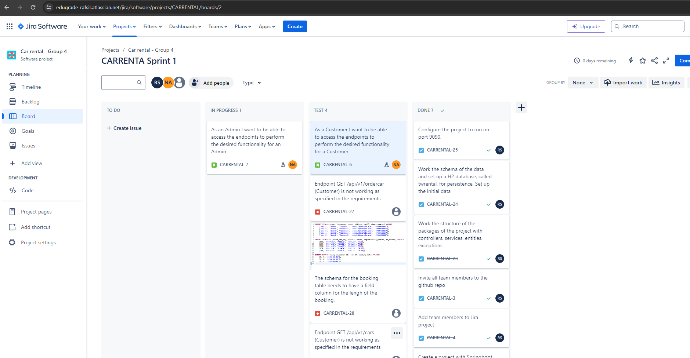
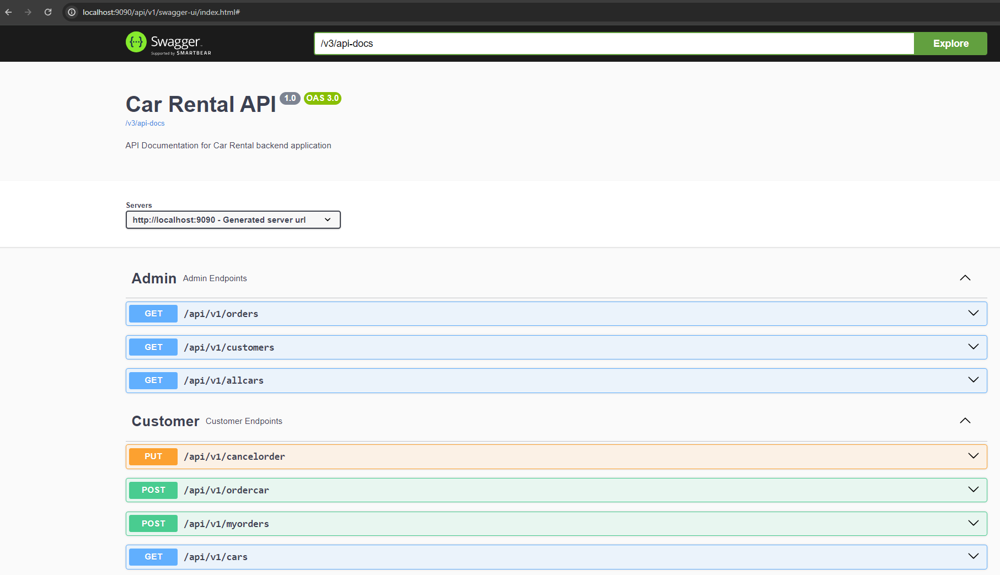

# Group Project

### This group assignment project is a partial requirement for the course Enterprise Java, part of the program *Agil Javautvecklare - distans* at *Edugrade* (Sweden, spring 2024).

## Group members:
* Andreas Arousi
* Fahri Kuzey
* Nadia Ben Abla
* Rafael Silva

## Resources: 
* Link to project on GitHub: https://github.com/rasi10/car-rental-groupD
* Link to project on Jira: https://edugrade-rafsil.atlassian.net/jira/software/projects/CARRENTAL/boards/2

* Swagger: http://localhost:9090/api/v1/swagger-ui/index.html

## Sample request with HTTP Client: 

